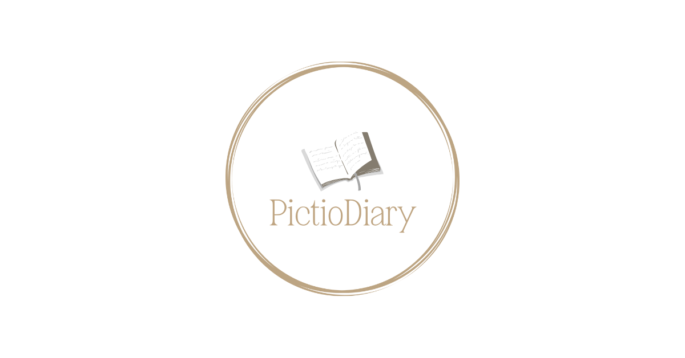
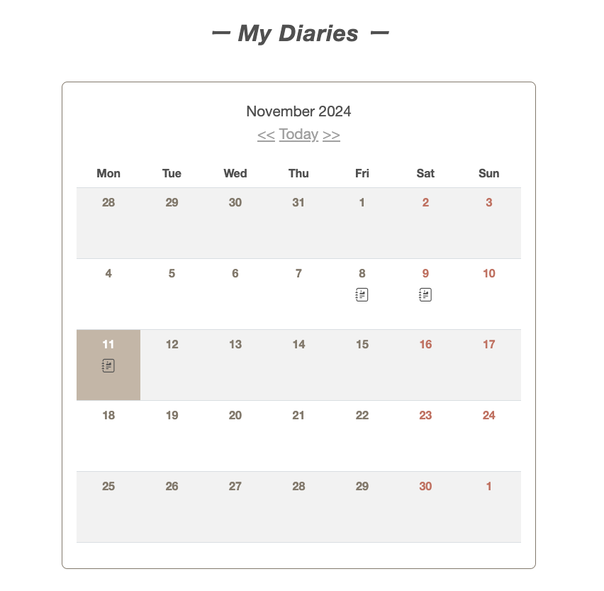
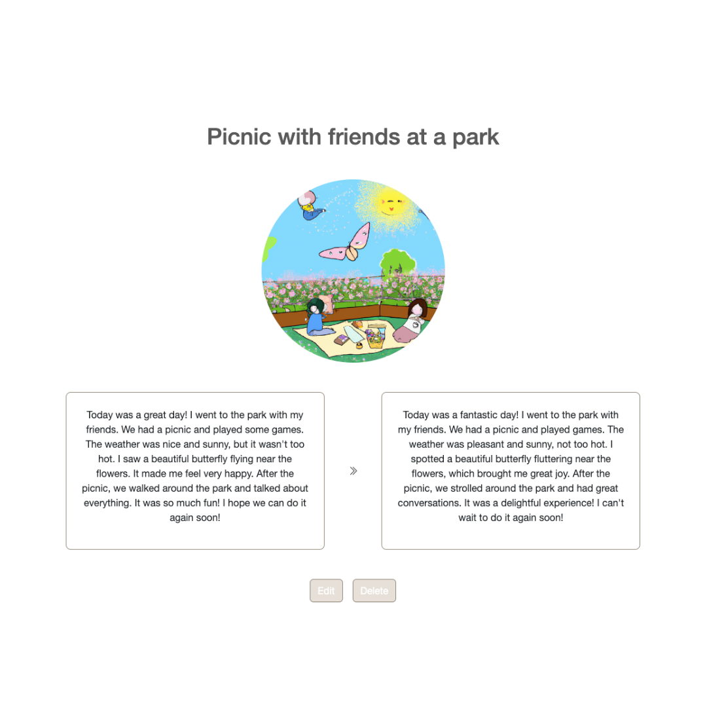

# 📔PictioDiary
サービスURL：https://www.pictiodiary.com/
 
 

### ■サービス概要
日頃アプトプットの機会があまりないという英語学習者に向けた 
英文絵日記作成アプリです。

### ■サービス開発の背景
私は英語学習においてアウトプットは特に大事だと、過去の学習・留学体験を経て特に感じていました。 listening、speakingを多くされている方は見かけますが、一から文章を作成することも同じぐらい大事で英語学習において大きなメリットになると考えているので、 日記というフランクに書けるものを作成したいと思いました。 
また、少しでも楽しいと思ってもらえるよう絵日記にすることで視覚的な楽しさの要素を加え、継続して絵日記を書き学習の一環としてもらえたらと思っています。

### ■機能紹介

| ユーザー登録 | ログイン |
| :---: | :---: |
|  |  |
| 
「メールアドレス」「パスワード」「確認用パスワード」「名前」を入力してユーザー登録を行います。
 | 
LINEログインも可能です。

 

| カレンダー機能 |
| :---: |
|  |
| 
これまでの作成した絵日記が見えることで、継続する意欲につながるようにカレンダーで表示させています。
|
 

| AI添削機能 / 画像生成機能|
| :---: |
|  |
| 
 新規作成をするとAIの添削と画像生成が行われ表示されます。画像は絵日記風の画風で設定しています。 
 |
 

### ■使用技術

| カテゴリ | 技術内容 |
| --- | --- | 
| バックエンド | Ruby on Rails 7.2.2・Ruby 3.2.3 |
| フロントエンド | Bootstrap5 |
| Web API | OpenAI API・LINE Developers |
| データベース | PostgreSQL |
| インフラ | Heroku |
| バージョン管理ツール | GitHub |

### ■ER図
 https://drive.google.com/file/d/1T569KEKFF6YmZ6AOLRB4vDyJgQ6SkgRE/view?usp=sharing

### ■画面遷移図
https://www.figma.com/design/x5pR9bHkPmLKpVZPtiKzRq/Portfolio?node-id=0-1&t=8zaH9eaWMQ2dT5n5-1